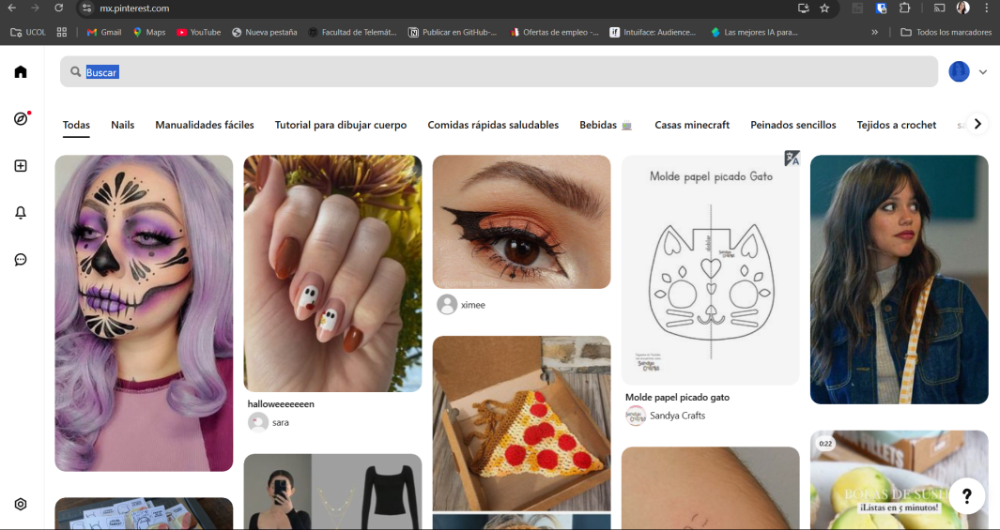

# **"Pinteres"**

Este proyecto es una réplica de la interfaz de usuario de Pinterest utilizando HTML. El objetivo es recrear la estructura visual y funcional de la plataforma, incluyendo la disposición de los elementos, los mosaicos de imágenes y la navegación. Con este proyecto se busca profundizar en el uso de HTML para mejorar habilidades en frontend, imitando un diseño web moderno y atractivo.

---

## **AUTORES**

1. **Jonatan**  
    - Correo: [jonreabarbosa@gmail.com](mailto:jonreabarbosa@gmail.com)
2. **Scarlett**  
    - Correo: [ssolorzano0@ucol.mx](mailto:ssolorzano0@ucol.mx)
3. **Kaleb**  
    - Correo: [rtkaleb@gmail.com](mailto:rtkaleb@gmail.com)
4. **Jusef**  
    - Correo: [jair.jcp@hotmail.com](mailto:jair.jcp@hotmail.com)
5. **Tony Napoles**  
    - Correo: [An631_123@hotmail.com](mailto:An631_123@hotmail.com)
6. **Jorge Adan**  
    - Correo: [jorgadan@icloud.com](mailto:jorgadan@icloud.com)

---

### **Repositorio**
[https://github.com/JonatanRB/proyectoFinal](https://github.com/JonatanRB/proyectoFinal)

### **Github Pages**
[https://jonatanrb.github.io/proyectoFinal/](https://jonatanrb.github.io/proyectoFinal/)
